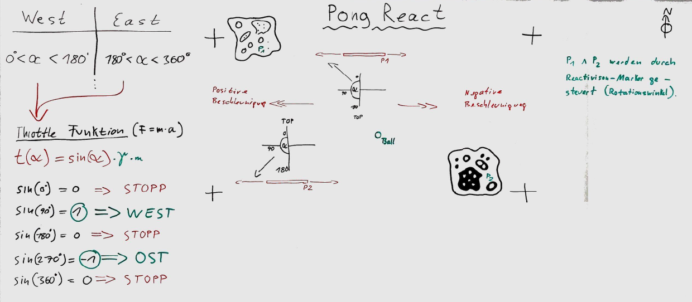
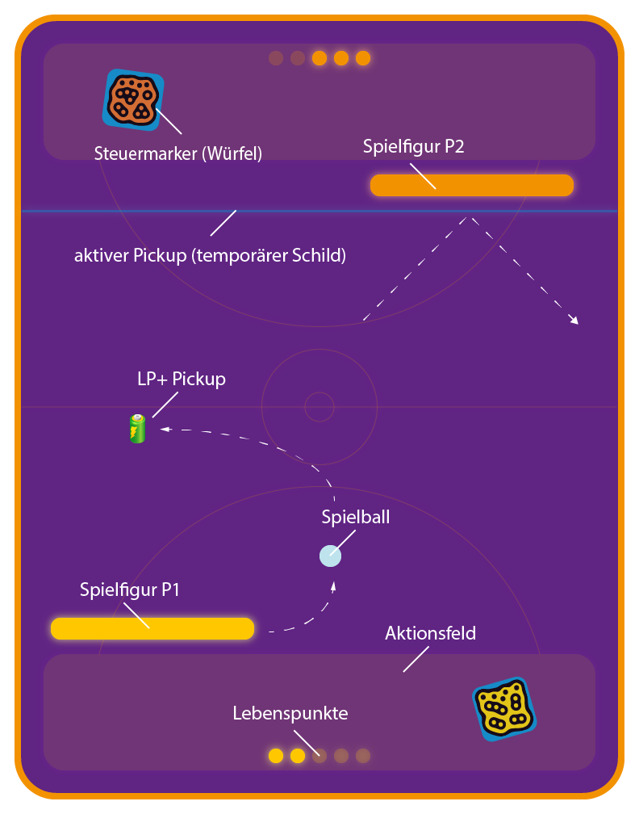
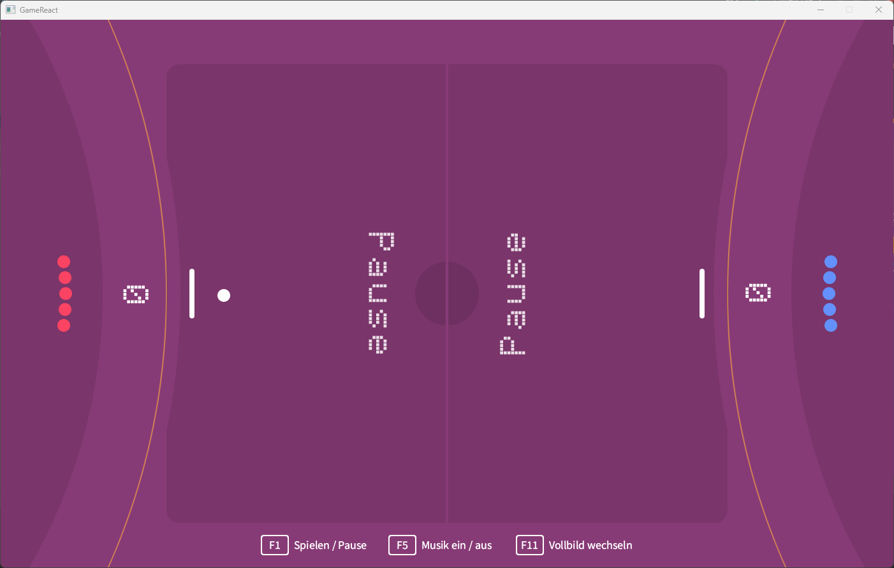
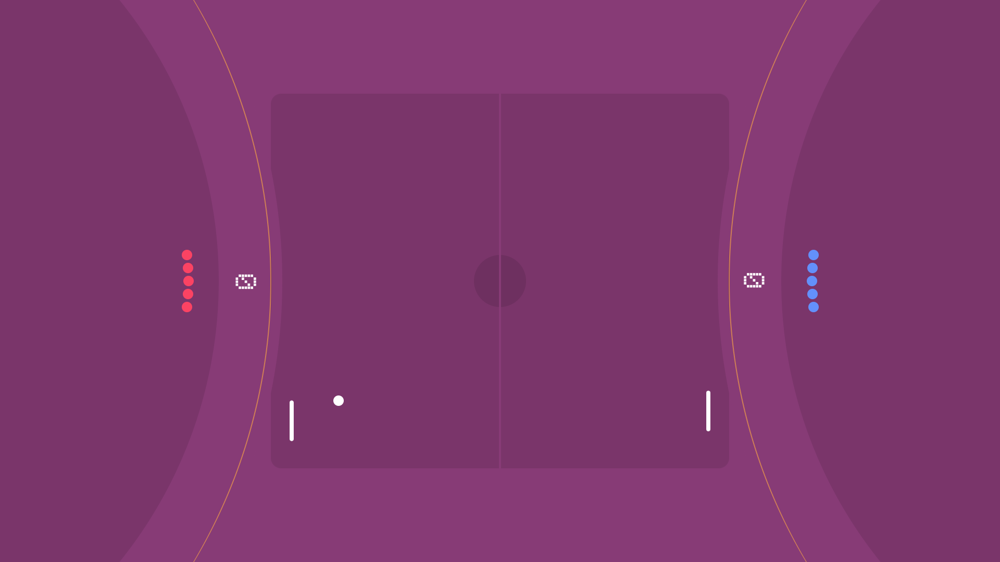

# Beispielanwendungen

1. [Pong React](#pong-react)

## Pong React

**Pong React** ist die ReacTIVision-Implementation des Spieleklassikers "Pong". Hierbei
werden die Schläger allerdings nicht mit der Tastatur, sondern mit Marker-Würfeln gespielt.
Je nach Rotationswinkel wird der Schläger entweder nach links oder nach rechts bewegt.

Ziel des Spiels ist es, den Tennisball ins gegnerische Aus zu manövrieren.

Die Skizze zeigt, wie der Rotationswinkel in Richtung und Geschwindigkeit übersetzt wird.

Das Spielfeld sieht im ersten Entwurf folgendermaßen aus:

Da ein Beamer oder ein Monitor normalerweise im Querformat arbeitet, wurde das Layout um 90° gedreht.
Einige optische Änderungen wurden ebenfalls vorgenommen. So sieht das aktuelle Layout aus:

Im Vollbildmodus wird die Spielfläche nicht skaliert, wodurch die Kreisausschnitte an den
Bildschirmrändern mehr Platz zum Ablegen der Marker bieten:

